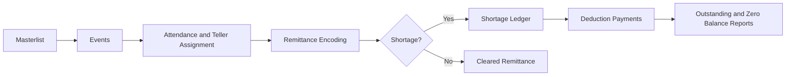
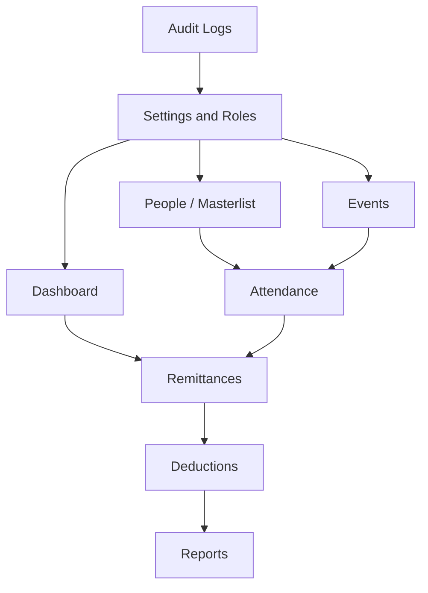

# Remittance Management System

<p align="center">
  
  
  
  
  
</p>

<p align="center">
  Teller remittance encoding, shortage tracking, deductions, and reporting in one focused internal operations system.
</p>

---

## Overview

The **Remittance Management System** is a Laravel + Inertia application built to manage teller assignments, encode remittances per event, detect shortages automatically, post deductions, and monitor remaining balances across previous events.

It is designed for a workflow where:

1. a masterlist of people is maintained,
2. an event is created and marked active,
3. tellers are assigned through attendance,
4. remittances are encoded per teller,
5. shortages are recorded automatically,
6. deductions are posted until balances are fully settled.

---

## Visual Workflow



## Module Map



---

## Core Features

- **Masterlist management**
  - Maintain people records with code, complete name, and teller-ready profile data.

- **Event management**
  - Create events, activate the current working event, and manage event context for remittance operations.

- **Attendance and teller assignment**
  - Assign people to an event and designate their teller number or position before encoding.

- **Per-person remittance encoding**
  - Encode remittance values for each assigned teller.
  - Compare system cash on hand and teller cash on hand.
  - Detect shortages automatically based on entered values.

- **Automatic shortage ledger**
  - Shortages are generated from remittance encoding and linked back to the event and teller assignment.

- **Consolidated deductions**
  - Post partial or full payments against a person's open shortages.
  - Allocate payments across older shortage balances automatically.

- **Previous-balance visibility**
  - Remittance encoding surfaces previous outstanding shortage amounts so users can see if a teller still has remaining short from earlier events.

- **Reports and exports**
  - Event shortages
  - Outstanding balances
  - Zero balances
  - Person ledger
  - Deduction history
  - Export-ready report routes

- **Role and permission controls**
  - User role management through settings using `spatie/laravel-permission`.

- **Audit visibility**
  - Audit log access for tracking important system actions.

---

## Screens Overview

| Screen | Purpose |
| --- | --- |
| `Dashboard` | High-level metrics for active operations and balances |
| `People` | Masterlist maintenance |
| `Events` | Event creation, activation, and event management |
| `Attendance` | Assign tellers for the active event |
| `Remittances` | Encode teller remittance and detect shortages |
| `Deductions` | Post payments against shortage balances |
| `Reports` | Review balances, shortages, and ledger history |
| `Settings` | Update system configuration and user roles |
| `Audit Logs` | Review tracked user/system actions |

---

## Tech Stack

- **Backend:** Laravel 12
- **Frontend:** React + Inertia.js
- **Styling:** Tailwind CSS
- **Routing:** Laravel web routes with authenticated middleware
- **Permissions:** `spatie/laravel-permission`
- **Audit logging:** `spatie/laravel-activitylog`
- **PDF/export support:** `barryvdh/laravel-dompdf`

---

## Local Setup

### 1. Clone the repository

```bash
git clone https://github.com/akihiko403/remitance-management-system.git
cd remitance-management-system
```

### 2. Install dependencies

```bash
composer install
npm install
```

### 3. Prepare environment

```bash
copy .env.example .env
php artisan key:generate
```

Update your database connection in `.env`.

### 4. Run migrations and seeders

```bash
php artisan migrate
php artisan db:seed
```

### 5. Start the app

```bash
composer run dev
```

This starts:

- Laravel development server
- queue listener
- log stream
- Vite frontend build

---

## Default Seed Data

The project includes starter data for faster local setup, including:

- system roles and permissions
- settings
- demo users
- masterlist seed entries

If you want to reseed only the masterlist:

```bash
php artisan db:seed --class=MasterlistSeeder
```

---

## Main Routes

| Route | Description |
| --- | --- |
| `/dashboard` | Dashboard |
| `/people` | Masterlist / people |
| `/events` | Event management |
| `/events/{event}/attendance` | Attendance and teller assignment |
| `/remittances` | Active event remittance encoding |
| `/deductions` | Shortage payment posting |
| `/reports/event-shortages` | Event shortage report |
| `/reports/outstanding-balances` | Outstanding balances report |
| `/reports/zero-balances` | Fully settled balances report |
| `/reports/person-ledger` | Person ledger report |
| `/reports/deduction-history` | Deduction history report |
| `/settings` | System settings and user role management |
| `/audit-logs` | Audit log viewer |

---

## Business Flow

```text
Masterlist -> Event Setup -> Attendance / Teller Assignment -> Remittance Encoding
-> Auto Shortage Creation -> Deduction Payments -> Reports / Audit Review
```

---

## Notes

- Remittance encoding is tied to the **active event**.
- Shortages are computed from remittance and cash-on-hand values.
- Deductions can be posted without leaving remittance flow when a teller has previous outstanding balance.
- Reports are designed to support operational review and settlement tracking.

---

## License

This project is provided for internal or organizational use. Update this section if you want to publish it under a specific open-source license.
